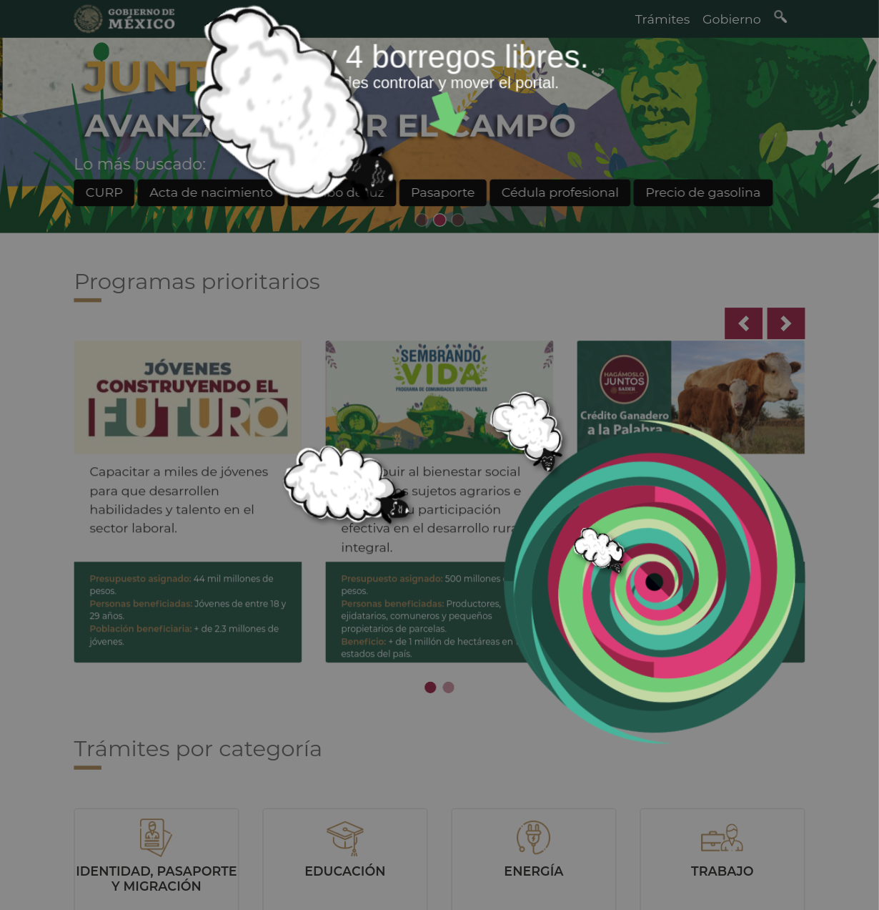

  <h2> BlockGobExtension #2 </h2>
  <h3> Boregos Libres </h3>
  <section>
    <h4>Descripción:<h4>
    

    
 Esta extensión de Chrome tiene una dinámica sencilla:

        Sólo funciona en horarios no hábiles de trabajo de oficina.  
        <strong>[ L - V | 9 - 18 hr ]</strong>
    

    
 
    Cuándo un nuevo usuario utiliza la extensión, se librea a un borrego en la pantalla.
    

    

      Estos borregos tienen una huella digital generada con base en algunas especificaciones de la computadora en donde esta instalada la extensión.
    

    

      Con base en esta se genera el borrego listo para ser liberado. 
    

      

        Los borregos siempre se acercan al portal y el usuario puede moverlo con el mouse. 
      

      
    

  </section>
  <section>
    <h4>Instrucciones para instalar la extensión.</h4>
    <ol>
      <li>
      Clonar o Forkear el repositorio en la máquina del usuario. 
      <code> git@github.com:ricardoglez/borregosLibresExtension.git </code>
      </li>
      <li>
      Cuando el repositorio esta en la maquina del usuario. instalar las dependencias del proyecto con :
      <code> npm install </code>
      </li>
      <li>
        Ya que estan listas las dependencias, compilar el proyecto con:
        <code> npm run production </code>
      </li>
      <li>
        Al finalizar la compilación se creará una carpeta llamada <strong> build </strong>. Esta carpeta contiene la extensión. Para instalarla ir a 
        esta dirección en el navegador de chrome <code> chrome://extensions </code> 
      </li>
      <li>
        Activar el modo de programador con el switch del lado superior izquierdo   
      </li>
      <li>
        Dar clic en cargar paquete y seleccionar la carpeta <strong> build </strong>
      </li>
    </ol>
  </section>
  <strong>errege @ 2019 </strong>

