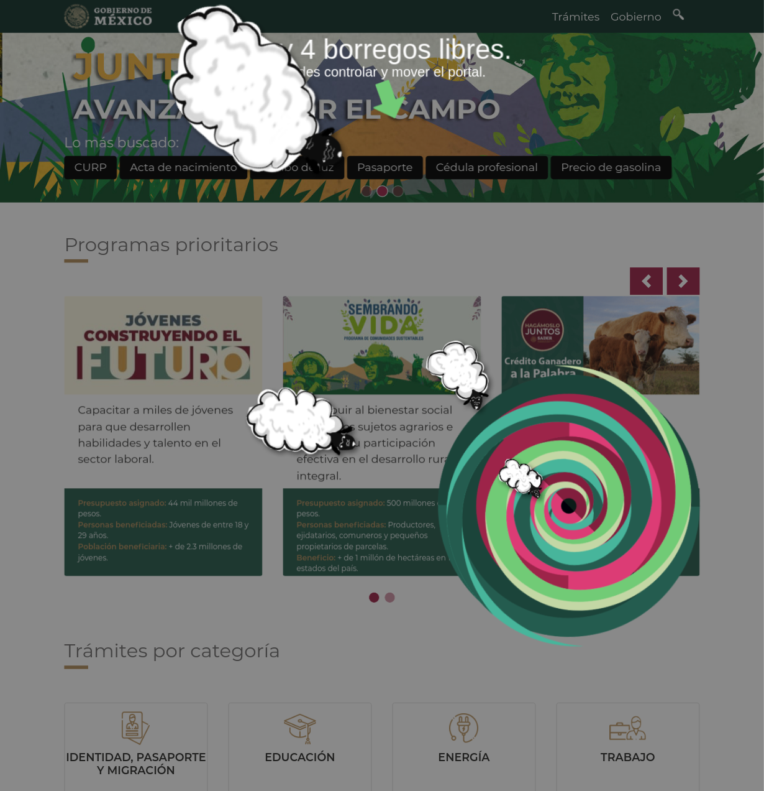

  <h2> Boregos Libres </h2>
  

  
 Esta extensión de Chrome tiene una dinámica sencilla:

      Sólo funciona en horarios no hábiles de trabajo de oficina.  
      <strong>[ L - V | 9 - 18 hr ]</strong>
  

  
 
   Cuándo un nuevo usuario utiliza la extensión, se librea a un borrego en la pantalla.
  

    

      Los borregos siempre se acercan al portal y este puede moverse con el mouse. 
    

    
  

